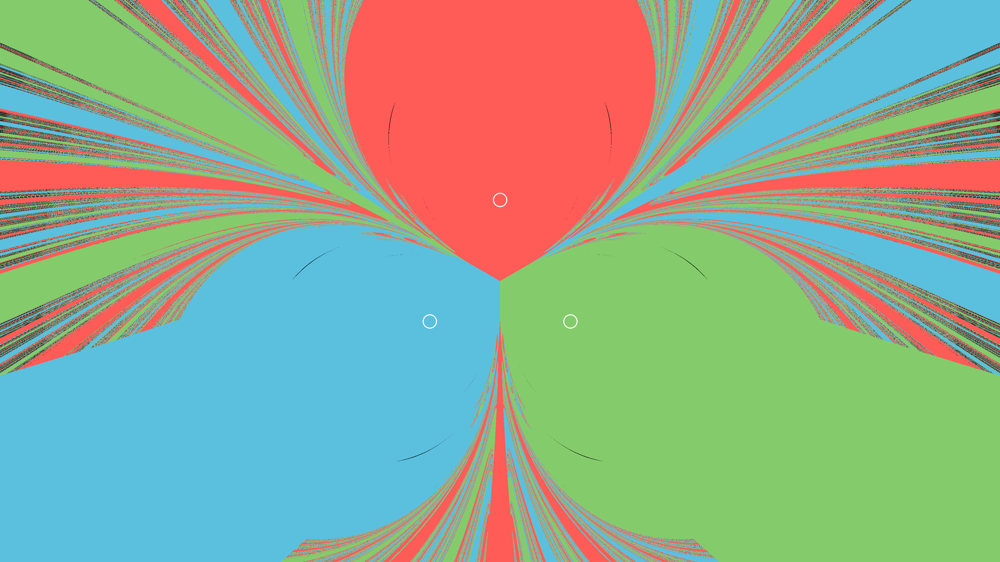

# Restrictive n-body problem

[](LICENSE)
[](https://www.python.org/)
[](https://cupy.dev/)
[](https://www.manim.community/)
[](https://vispy.org/)

GPU-accelerated **basins of attraction** for a *restricted* n-body problem: planets are fixed, one test asteroid is launched from rest at each sample, and the pixel or lattice point is colored by which planet it hits. Optional extras: **time-to-hit** coloring, and a **1PN geodesic** flag (frozen multi-mass field, not a GR-self-consistent spacetime).

<p align="center">
  
</p>

<p align="center"><em>2D slice through three equal masses on an equilateral triangle. Color = colliding planet. Black = timeout (no hit by <code>t_max</code>). White rings = planet cross-sections with the slice.</em></p>

## What it does

This is not a free n-body integration of all bodies. The planets stay put (positive mass attracts, negative mass would repel). Each asteroid starts at rest and is integrated with **per-particle RK4** on the GPU (CuPy). By default the force is Newtonian inverse-square gravity (`force_exponent = 3`). A hit is a true geometric collision with an n-sphere of radius `R`, including the segment swept during a step so trajectories cannot tunnel through a planet. Hits are **not** inferred from periapsis. Default color is which planet was hit, in **coordinate time** (a static observer). The image is a map of initial points.

You can:

- Render a **2D still image**: one asteroid per pixel on a chosen 2-flat in n-D. They then move in the full ambient dimension `D`. White outlines mark where each n-sphere meets the image plane (`sqrt(R² − dist²)`; omitted if the sphere misses the plane).
- Sample a **k-dimensional cube** of initial conditions and inspect it in an interactive **3D viewer**. The white box is the first three cube axes. Extra axes (`u4…uk`) are chosen with sliders. Lattice slices parallel to `yz` / `xz` / `xy` can be toggled. Planet balls are the n-sphere ∩ current 3-flat.
- **Save / open** a 3D run as `.npz` so you can explore a long simulation without recomputing it.
- Optionally color by **time to hit** (2D flag, or a switch in the 3D viewer) or turn on the **relativistic** 1PN geodesic flag (same ICs, flag on vs off).

Default planets are the ``PLANETS`` list in [`simulation.py`](simulation.py) (equilateral triangle in `xy`). Edit that list to change count, position, mass, radius, color, or embedding dimension. The length of each ``position`` is that planet’s dimension; shorter tuples pad extra coordinates with `0`, so a 3D planet and a 4D planet can share one simulation.

## Planets

In [`simulation.py`](simulation.py), each row of `PLANETS` is independent:

```python
PLANETS = [
    Planet(position=(0.0, 0.577), mass=1.0, radius=0.05, color=(255, 92, 87)),
    Planet(position=(-0.5, -0.289), mass=1.0, radius=0.05, color=(91, 192, 222)),
    Planet(position=(0.5, -0.289), mass=1.0, radius=0.05, color=(132, 204, 107)),
]
```

Add or remove `Planet(...)` entries for more than three bodies. A 3D location is `(x, y, z)`; a 4D location is `(x, y, z, w)`. Both the 2D scene and the 3D viewer use this list.

## Requirements

- Python **3.10+**
- An **NVIDIA** GPU with a **CuPy** build that matches your CUDA toolkit ([CuPy install](https://docs.cupy.dev/en/stable/install.html)). macOS is not supported.
- `numpy`, `pillow`
- **2D stills:** [Manim](https://www.manim.community/)
- **3D viewer:** [VisPy](https://vispy.org/) with the **glfw** backend (and Tk for the control panel)

## Install

From the project root:

```bash
python -m venv venv
```

Windows:

```bash
venv\Scripts\activate
```

Linux:

```bash
source venv/bin/activate
```

```bash
pip install numpy pillow manim vispy glfw
pip install cupy-cuda12x
```

Replace `cupy-cuda12x` with the wheel for your CUDA version (`cupy-cuda11x`, `cupy-cuda12x`, …). See the CuPy install page if you are unsure.

## 2D images

Edit the class attributes at the top of [`n_body_problem.py`](n_body_problem.py) (`EquilateralBasins`):

| Knob | Meaning |
| --- | --- |
| `dimension` | Slice embedding `D` (planets pad to `max(D, their position lengths)`) |
| `G`, `dt`, `t_max` | Gravity strength, max RK4 step, integration cutoff |
| `relativistic`, `c_light` | Off by default. `True` uses 1PN test-particle geodesics; `c_light` is `c` in these units (suggested `10`) |
| `time_to_hit` | Off by default. `True` colors pixels by collision time instead of which planet was hit |
| `plane_points` | Three n-D points: origin, image `+x`, image `+y`. `None` uses `view_center` in `xy` |
| `view_height` | Height of the framed rectangle on that plane (width follows image aspect) |

Render a still. Pixel count is the Manim resolution (`-r`); that is also the asteroid count (`width × height`):

```bash
manim -s -r 1920,1080 n_body_problem.py EquilateralBasins
manim -s -r 3840,2160 n_body_problem.py EquilateralBasins
```

The PNG is written to `output/equilateral_basins_{W}x{H}.png` (not Manim’s `media/` folder). With `time_to_hit = True` the name is `equilateral_basins_{W}x{H}_time.png` (red at `t ≈ 0` through blue to black at `t_max`). Unhit pixels stay black. White rings are planet–plane cross-sections.

## 3D / n-D viewer

Edit the knobs at the top of [`viewer_3d.py`](viewer_3d.py) **before** starting a new simulation (they are ignored when you open a saved model):

| Knob | Meaning |
| --- | --- |
| `RESOLUTION` (`r`) | Lattice points per cube axis |
| `HALF_EXTENT` (`h`) | Cube coordinates run through `[-h, h]` on each axis |
| `CUBE_CENTER`, `CUBE_AXES` | Center `C` and `k` spanning vectors. First three axes are the visible box; further vectors add extra dimensions and sliders |
| `G`, `DT`, `T_MAX` | Same physics as the 2D scene |
| `RELATIVISTIC`, `C_LIGHT` | Same geodesic flag as the 2D scene (default off). Stored in `.npz` meta; old files without these keys are Newtonian |

Asteroid count is **`r^k`**. Example: `r = 48`, four axes → about **5.3 million** asteroids. That is slow and memory-heavy; drop `r` or `k` while experimenting.

```bash
python viewer_3d.py
python viewer_3d.py output/my_basins.npz
```

**Controls**

- **Drag** to rotate, **scroll** to zoom, **Shift+drag** to pan.
- **Extra dimensions:** each slider picks one lattice value on `u4…uk`, i.e. which 3-flat you are looking at. Default is the slice nearest extra-coordinate `0` (where the default triangle lives).
- **Coordinate planes:** three face diagrams, `r` lines each. A lattice point `(i, j, k)` lies on one `yz` plane (`i`), one `xz` plane (`j`), and one `xy` plane (`k`). Visible points are the **union** of enabled planes (after the extra-dim slice). Click a line to toggle; hover previews that plane; **All on** / **All off** reset the set.
- **Planets / hit points:** show or hide each planet ball and its colored markers. Planet meshes are the solid planet color with a white wire outline, sized to the apparent 3-ball `sqrt(R² − dist²)` (hidden if the n-sphere misses this 3-flat).
- **Coloring:** default is planet (collision) colors. **Color by time to hit** switches the same points to the red→black collision-time map (red = fast, black = `t_max`). Timeouts stay hidden. The switch is disabled on old `.npz` files that have no `time` array.
- **Save model / Open model:** `.npz` stores the **initial** lattice, hit indices, collision times, and cube metadata. Filters (sliders, planes, coloring switch) are view-only and are not saved. Old files without `time` still open; they can only use planet colors.

Timeouts are not drawn. The log line `alive=… active=…` means: `alive` = not yet collided (including particles that will time out); `active` = still being stepped this iteration (alive and short of `t_max`). Collided asteroids are dropped from the GPU work set.

## Physics notes

- Force on an asteroid is `G m (p − x) / |p − x|^e` with default `e = 3` (inverse square). Softening avoids a singular `0/0` at a planet center.
- Step size is **CFL-limited** near a surface so a step cannot jump over a planet.
- Collision if the asteroid is inside radius `R` or the accepted segment intersects the sphere. Collisions stay Euclidean n-spheres even when the relativistic flag is on.
- Inf/NaN from a blown-up step is attributed to the nearest planet.
- Time-to-hit coloring maps `t / t_max` red → orange → yellow → green → blue → black (timeouts black). 3D files store both hit index and time; the viewer switch defaults to planet colors.

### Relativistic flag (off by default)

A restricted test particle in a **prescribed static** multi-mass field; planets are frozen and are **not** a GR-self-consistent spacetime. Exact multi-planet GR is not a unique closed-form metric, so this toy uses one Newtonian potential `Φ = −Σ G m_i / r` and isotropic 1PN geodesic acceleration in coordinate time `t`:

`a = −∇Φ (1 + v²/c² + 4Φ/c²) + 4 v (v · ∇Φ) / c²`

Set `relativistic = True` (2D) or `RELATIVISTIC = True` (3D). `c_light` is `c` in these units (`G = 1`, sizes ~ `1`); Newtonian speeds are order-1, so **`c` must not be huge** or the flag looks identical to Newton. Suggested default is `10`. Relativistic Φ is always inverse-square (`force_exponent` is ignored on that path). Speed is clipped below `c`. The PNG/3D view is still hit-color in coordinate time: no time dilation of the image, no gravitational lensing.

**Compare Newton vs relativity:** run the same initial conditions twice — flag off vs on — with the same `PLANETS`, grid, `G`, and `t_max`. Read the integrate logs for `max |v|/c` and `max |Φ|/c²`. If both stay `<< 1`, the basin will match Newton; lower `c_light` (or raise masses). If `2 G m / c²` is a large fraction of a planet radius or of typical planet–planet spacing, a warning is printed: the weak-field formula is being used as a toy.

## License

[MIT](LICENSE) © 2026 Nirav Ramdhanie
